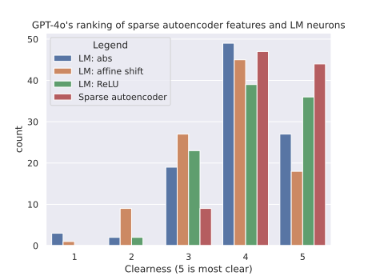

# Automatic feature examination

Obviously doesn't scale

There are three ways we could interpret the activations:

System prompt:

> You are a helpful assistant.

User prompt:

> I'll send you a sequence of texts,
> where tokens have been highlighted using Unicode Block Elements.
> Look for a pattern in which tokens get strong highlights.
> Rank how clear the pattern is on a 1-5 scale, where 1 is no detectable pattern,
> 3 is a vague pattern with some exceptions, and 5 is a clear pattern with no exceptions.
> Focus on the pattern in the strong highlights. Describe the pattern in 10 words or less"

grain of salt: gives high clearness to something that isn't clear

## Notable neurons

## Comparing to raw LLM neurons

TODO Note that what I call neurons
are the residual stream activations. 
i.e. the exact tensors I trained the SAE on 

Anthropic
compared their autoencoder's interpretability
to neurons in Claude's previous MLP layer.

My prior is that the LLM activations
won't correspond to specific topics.

My prior is that the MLP neurons wouldn't be interpretable either.

Go through some examples in detail to show that GPT-4o is wrong

It'd be nice if we could see how the SAE gets better over training time

Really we need a less noisy metric than this. Ideas for improvements:

- Reading Unicode block elements might be tricky for the LLM
- Tell it "be strict"
- Change the question. First ask it to figure out the theme, then ask a different LLM to rank how closely the highlighting matches the theme, or ask it to use the theme to distinguish highlighting-using-that-feature from highlighting-that-doesn't-use-that-feature
- Increase sample size until clearly statistically significant
