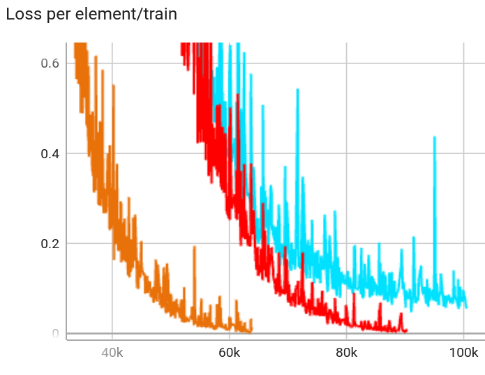

# Training an autoencoder

Let's forget about the sparse
part for now. What we want is an autoencoder: a neural
network that takes some input and tries to outputs
the same thing.

Q: That sounds like it's trying to do nothing.<br>
A: Yes, but the autoencoder does it in a complicated way. More on this [below](#whats-the-autoencoder)

## What's the input?

Anthropic trained on the activation after a middle layer of Claude:

> we focused on applying SAEs to residual stream activations halfway through the model (i.e. at the “middle layer”).

They have various justifications for this. My intuition is that the middle layer is maybe where
the model is thinking the most about concepts, because at the front and back it has
to think more about processing input and preparing output, respectively.
(See also [this paper](http://arxiv.org/abs/2308.03296):
"the middle layers [focus] on more abstract patterns".)

TinyStories-33M has
4 transformer layers. So we
take the activation after the 2nd
layer, while feeding it short stories
from the `roneneldan/TinyStories` dataset.
This is a vector in \\( \\mathbb{R}^{768}  \\),
i.e. a list of activation strengths, one for each of 768 neurons.

## What's the autoencoder?

If the autoencoder did nothing, that would be

```python
def autoencoder(llm_activations):
    return llm_activations
```

It's a little more complicated than that:

```python
def autoencoder(llm_activations):
    features = relu(encoder_linear(llm_activations))
    return decoder_linear(features)
```

In this function:

- [ReLU](<https://en.wikipedia.org/wiki/Rectifier_(neural_networks)>) maps negative elements to 0
- `encoder_linear` is an affine transformation \\( x \\mapsto Ax+b \\), where \\(A\\) is the weight matrix and \\(b\\) is the bias vector
- `decoder_linear` is another affine transformation (with different weight \\(C\\) and bias \\(d\\))

Q: Why does this have the fancy name autoencoder? It's just a standard [MLP](https://en.wikipedia.org/wiki/Multilayer_perceptron).<br>
A: Because there are some more constraints:

- `encoder_linear` is \\( \\mathbb{R}^{768} \\to \\mathbb{R}^F \\), where
  F is the hidden dimension (F for number of Features) of the autoencoder.
  That is, `encoder_linear` takes a vector with 768 elements, and spits out
  a vector with F elements
- `decoder_linear` is \\( \\mathbb{R}^{F} \\to \\mathbb{R}^{768} \\). So the net effect
  is that `autoencoder` returns a vector with the same dimension as the input vector

We'd like `activations` and `autoencoder(activations)` to be as close together
as possible ("auto" means "self", not "car").
This won't happen by default, since `encoder_linear` and `decoder_linear`
are random transformations.
But we can quantify how far apart they are using an L2 norm:

```python
reconstruction_loss = ((activations - autoencoder(activations)) ** 2).sum()
```

And then we can use gradient descent to adjust the weights and biases of the autoencoder to
minimize the reconstruction loss.

## Training

Let's train autoencoders with different numbers of features:

- \\(F=100\\) (green)
- \\(F=767\\) (blue)
- \\(F=768\\) (red)
- \\(F=1000\\) (orange)

We'll save checkpoints every 5000 steps because we'll do some inference later.

```admonish warning
Pytorch makes it easy to save models
using `torch.save(model, path)`.

This is a bad idea.

If you 
later move the import class to a different 
file, you may not be able to load old
checkpoints. Did I know this anyway but still walk into this footgun? Yes.

The [safe](https://pytorch.org/tutorials/beginner/saving_loading_models.html#saving-loading-model-for-inference)
but clunkier way is
`torch.save(model.state_dict(), path)`.
```

Graph of the reconstruction loss over time:

<figure>
  
  <figcaption>The x-axis is number of steps</figcaption>
</figure>
Here, "per element" means that I'm normalizing by sequence length—else 
loss would be larger whenever it trains on a longer input text.

The blue curve is difficult to see because it's almost perfectly covered by red.

All the curves converge to 0 loss, except for \\(F=100\\).

This makes sense: If you have to compress a vector in
\\( \\mathbb{R}^{768} \\)
to a vector in
\\( \\mathbb{R}^{100} \\),
you're going to lose a lot of information that you
can't recover when decompressing.

Let's zoom in on the x-axis:



Here we see that
\\(F=767\\)
isn't actually converging to 0;
it gets stuck around `loss = 0.1`.

We can also explain this: projecting from
\\( \\mathbb{R}^{768} \\)
to
\\( \\mathbb{R}^{767} \\) (and back) loses just a little information.
